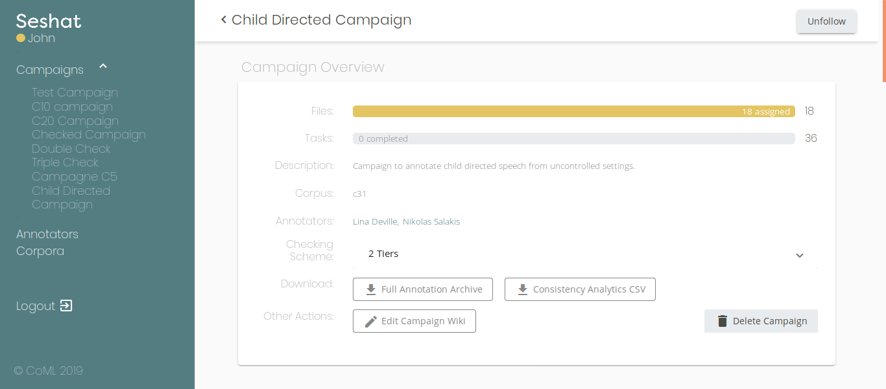

*Seshat was the ancient Egyptian goddess of wisdom, knowledge, and writing. 
 She was seen as a scribe and record keeper, and her name means she who scrivens (i.e. she who is the scribe), and is credited with inventing writing.*

# Seshat Annotation Manager

This is the main repository for the Seshat Annotation Management platform.

**What is Seshat?**

Seshat is a **self-hosted**, **web-based** platform to help linguists and speech specialists organize and manage annotation campaigns 
on audio/speech corpora of any size. It works hand-in-hand with the **Praat** annotation software.

**Why should you use Seshat?**

Seshat eases the assignation of annotation tasks to a pool of annotators.
It allows the annotation manager to track the advancement of a corpus's annotation.

**Ok, i'm interested, but is that it?** 

*Of course not*. Its flexible and easy-to-configure TextGrid checking system will help you 
ensure that all annotated files are free of human annotation errors and files mixup.
It also provides you with double-annotator annotation schema that will allow you to 
automatically get inter-annotator agreement metrics for your corpora.

**You have my attention. But how hard is it to use?**

Easy as English verb conjugation! We've put some extra care in making Seshat easy to set-up 
and easy to use, even for non-technical users.
We also made sure that the annotator's interface is as helpful as possible for them, 
so they can focus on annotating and not on figuring out if they're annotating right.

## Installing Seshat

We provide two ways to install Seshat:

* A simple [Docker-based install](https://seshat-annotation.readthedocs.io/en/latest/install.html) for non-technical 
  users.
* A [manual and custom install](https://seshat-annotation.readthedocs.io/en/latest/install.html) for 
  those who like to have a fine control over their system.

## Citing Seshat

This should be set once the paper is published.

