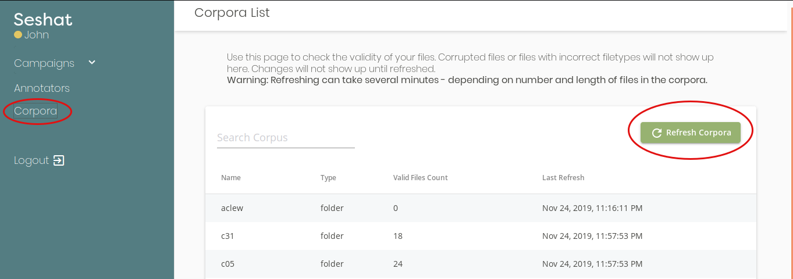

=====================================
Administering A Seshat Instance
=====================================

Managing Seshat
===============

Here, we'll teach you how to manage Seshat as the administrator, **not as the campaign manager**, on a **Docker**
or **Manual** install of seshat.
.. TODO : ref the manual and docker installs

Adding Audio Corpora
--------------------

.. _add-corpora-docker:

On a Docker Install
+++++++++++++++++++

Seshat's corpora folder is where you should drop your audio corpora. It's set up in your ``docker-compose.yml``
file. If you left it unchanged, it should be the ``corpora/`` folder in seshat's clone repository. Else,
it's the left side of the line:

.. code-block:: yaml

    volumes:
      # here it's '~/datasets/' for instance
      - ~/datasets/:/app/corpora

You should then just drop **corpus's folder (or CSV file) inside the special corpora folder**, not your corpus's content.
For instance, say you have 3 corporas, corresponding to 3 folders, then your special `corpora/` folder should
look like that::

    corpora/ <--- this is seshat's "magic" folder
    ├── some_corpus_summary.csv
    ├── corpus_1
    │   └── some files...
    ├── corpus_2
    │   └── some other files...
    └── corpus_3
        └── some more files...

After you've dropped a new corpus, or updated a corpus (by adding files to it) into seshat's `corpora/` folder,
you should then reach Seshat's "Corpora" page and refresh either the corpora list or the corpus's content:

.. note:: You don't have to restart Seshat's docker instance to add new corpora!

.. _add-corpora-manual:

On a Manual Install
+++++++++++++++++++

TODO

.. _reaching-env:

Reaching your Seshat Server Environment
---------------------------------------

.. _reaching-image:

On A Docker Install
+++++++++++++++++++

To reach into your Seshat docker, run

.. code-block:: bash

    docker exec -it seshat /bin/sh

If that doesn't work, list your running docker images with the following command, and check
that a seshat docker is indeed running.

.. code-block:: bash

    docker ps

.. note::You docker image contains (by default) a python environment with all of seshat's dependency installed,
   and the ``seshat-server`` package installed as well (the python package for seshat's different tools and libraries).

.. _creating-manager:

On a Manual Install
+++++++++++++++++++

TODO

Creating Manager Accounts
-------------------------

Let's say you want to add another manager's account with the following properties::

    First/lastname : Provençal Le Gaulois
    Email : provencal.gaulois@gmail.com
    Login : provencal
    Password : freewales

First, :ref:`reach into your server's environment <reaching-env>`. Then, just run the command::

    add-manager provencal freewales provencal.gaulois@gmail.com --first_name Provençal --last_name Le Gaulois

.. _web-access:

Setting up Seshat to be accessible from the web
-----------------------------------------------

On a Docker Install
+++++++++++++++++++

TODO

On a Manual Install
+++++++++++++++++++

TODO

Advanced Features for Seshat
============================

For these features, it's advised to have some basic knowledge of python, and especially of the Python toolchain
(pip, environments and python packages).

Adding custom parsers
---------------------

If you want to know how to implement your own annotation parser (used to check annotations in a specific Tier),
you should `visit the template's page <https://github.com/bootphon/seshat-parser-template>`_.

If you've already implemented a parser, or found one that fits your need and want to use it. Let's now install it.
First, :ref:`reach into your server's environment <reaching-env>`. We can now install your parser package.
The install command is dependant on the type of package for your parser, but there usually are only two
possibilities:

- Your parser package is in a github repository (most likely): run ::

    pip install git+git://github.com/myuser/seshat-parser-myparser

- Your parser package is hosted on pypi (regular type of install but rare for small custom packages): run::

    pip install seshat-parser-parsername

Your parser package should now be installed in seshat's python environment and automatically detected by the platform.
You should be able to find its installed parsers in the campaign creation view, when creating tier. However, if you
wish to check that your parser-package is effectively detected by seshat, and a that the parsers it makes avaible
have a valid implementation, you can run ::

    check-parser --list

This will show you all detected parser names. You can check an individual parser by running::

    check-parser --parser ParserName

Using the Seshat CLI
--------------------

As shortly mentioned in the :ref:`creating-manager`, Seshat includes a CLI (command line interface) that enables
its administrator to manage it using bash commands (in effect, you can manage it using bash scripts).

Here is a table listing all the CLI commands that are available, with a short description. If you need
more information on each command, :ref:`make sure you're inside your server's environment image <reaching-env>` and then
run a command with the ``--help`` argument, e.g. : ``assign-task --help``.

+--------------------+------------------------------------------------------------------------------------------+
| Command            | Description                                                                              |
+====================+==========================================================================================+
| add-manager        | Add an annotation manager to your Seshat instance.                                       |
+--------------------+------------------------------------------------------------------------------------------+
| add-annotator      | Add an annotator account to your Seshat instance.                                        |
+--------------------+------------------------------------------------------------------------------------------+
| delete-annotator   | Remove an account from your Seshat instance.                                             |
+--------------------+------------------------------------------------------------------------------------------+
| update-password    | Update the password of a user (Manager or Annotator).                                    |
+--------------------+------------------------------------------------------------------------------------------+
| check-corpus       | List and check the content of corpora imported by Seshat.                                |
+--------------------+------------------------------------------------------------------------------------------+
| check-parser       | List and check installed parser modules.                                                 |
+--------------------+------------------------------------------------------------------------------------------+
| assign-task        | Assign new tasks to annotators on an annotation campaign.                                |
+--------------------+------------------------------------------------------------------------------------------+
| delete-task        | Delete one or several assigned tasks.                                                    |
+--------------------+------------------------------------------------------------------------------------------+
| list-tasks         | List assign tasks for a campaign.                                                        |
+--------------------+------------------------------------------------------------------------------------------+
| campaign-gamma     | Retrive the campaign gamma scores (inter-rater agreement) for a campaign.                |
+--------------------+------------------------------------------------------------------------------------------+

Using the RESTful API
---------------------

In case the Seshat CLI doesn't fit your needs, and you'd like to administer the platform from an actual
programming language (i.e., not bash), you can make API calls directly to the Seshat RESTful Server. The
Seshat server serves its documentation in three formats
(thanks to `Flask Smorest <https://flask-smorest.readthedocs.io/en/stable/>`_):

- OpenAPI 3.0.1 API specification in JSON (at the address ``/doc/openapi.json``)
- SwaggerUI description (at the address ``/doc/swagger``)
- Redoc description (at the address ``/doc/redoc``)

.. note:: The address is prefixed by your server's address. If you're running (or accessing) Seshat's RESTful server locally,
   it should be (for the swagger doc, for instance) `<http://localhost:5000/doc/swagger>`_.

You should probably start by looking at the Swagger/Redoc description, which will provide you with a very user-friendly
interface that lists all of the API's endpoints. The server's implementation sanitizes and checks all inputs,
so you shouldn't be too much worried about messing up your instance if you sent it some ill-formed request.

.. warning:: To run any API call, you have to call the login endpoint first, which will return a login token. You should
   then include that token in *each* of your API calls, either as a GET argument (``?token=mytoken``) or in the
   HTTP request's ``'Auth-Token'`` header.

You can either build each request by hand, but we advise that you use some tool that takes advantage of the
OpenAPI 3.0.1 specification to communicate with Seshat's RESTful server.

If you require any help on how to use the API to do something, don't hesitate on asking us a question on our
`Github Page <https://github.com/bootphon/seshat/>`_.

