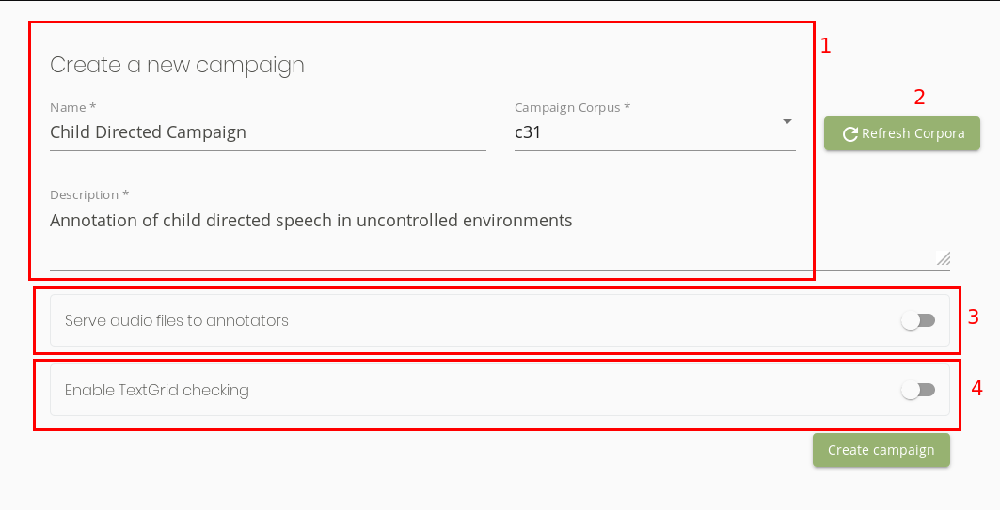

================================
The Campaign Manager's Reference
================================

In this page, we define and explain the terms introduced in Seshat. Think of this page
as Seshat's rulebook.

.. _audio-corpus:

Audio Corpus
------------
A set of audio/speech files that a :ref:`campaign-manager` wants to annotate.
It is indicated either by a folder containing sound files, or by a CSV summarizing a set of files.
Seshat support the same formats as Praat so far: WAV, Flac and MP3.

For more information on how to format your audio corpora and import them into seshat, take a look at :any:`corpus`

.. _campaigns:

Annotation Campaigns
--------------------

An object that enables the :ref:`campaign-manager` to assign :ref:`annotation-tasks`
to the :ref:`annotators`. It references an :ref:`audio-corpus`, and allows the
Manager to track the annotation's tasks progress and completion in real time.

Campaign Configuration
++++++++++++++++++++++

When creating a campaign, there are a small number of properties you can configure, which will be explained here.
Let's see a screenshot of the campaign creation interface:

   The campaign creation interface.

Let's go over the different parts of this interface, highlighted by the red boxes:

1. This is where you set the campaign's basic properties:

    * Its name (from which a *slug* will be computed, and will serve as the campaign's unique ID).
      Make sure to keep that name different from other campaigns to prevent mixing them up.
    * Its corpus. This is where you pick the :ref:`audio-corpus` (previously put in Seshat's ``corpora/`` folder).
    * Its description. This has no particular effect of the behavior of Seshat. It's just there to remind you what
      this campaign is about. Keep it short and informative.

2. This button asks Seshat to refresh the list of detected corpora. Seshat will go over all the files in its ``corpora/``
   folder and if new corpora are detected, will start to track them. This might be useful if you recently added a corpus
   to Seshat, and it hasn't been automatically detected. **If an added corpus is large, lots of files or big audio files,
   this make take a bit of time**.
3. This is to set whether or not the annotators will be given the corpus's audio file when being assigned
   an annotation task. Note that they'll have only access to the audio files they've been assigned to.
4. This is to set the :ref:`textgrid-checking-scheme` for that campaign. Proceed to that section to understand how it
   works.

Campaign Properties
+++++++++++++++++++

Once a campaign is created, you'll be able to see it in the campaigns list. You can view a full summary of a
campaign's properties by clicking on the *View* button. This is what you should see:

.. figure::  ../images/campaign_view.png
   :align:   center

   The campaign status

Let's go over the different Informations that are displayed in this view:

* **Tasks** : Number of completed :ref:`annotation-tasks` vs total number of assigned tasks.
  This progress bar is here to help you track the advancement of your campaign.
* **Files** : Number of files with an assigned :ref:`annotation-tasks` vs total number of files in the campaign's designated
  corpus. This is to give you a sense of how much of your corpus has been covered by the campaign.
* **Description** : This is the corpus description set at the campaign's creation.
* **Corpus** : This is the name of the corpus that you picked at the campaign's creation. All tasks assignments
  will be on files from that corpus.
* **Annotators** : This is a list of all the annotators that have received :ref:`annotation-tasks` in this campaign.
  This is automatically computed by Seshat.
* **Checking Scheme** : A short summary of this campaign's :ref:`textgrid-checking-scheme`, if you set any.
* **Actions** : Button to retrieve a structured archive (zip file) of all the task's textgrids, along with a CSV
  summary of the TextGrid's creation.
* **Other Actions** : For now, the only possible action is to edit the campaign's wiki page, which we will explain
  in the next section.

.. note:: Apart from the wiki page's content and assigning tasks, none of the campaigns' properties can be edited.
   The most important field where this is enforced is the campaign's :ref:`textgrid-checking-scheme`. This is to
   ensure that all TextGrid files submitted to a campaign are "cast in the same mould". If you wish to use
   another (even slightly different) checking scheme, create another campaign with a new scheme.

Campaign Wiki Page
++++++++++++++++++

Each campaign has a wiki page which can be edited in Seshat's interface (by clicking on the aforementioned
"Edit Campaign Wiki" button, in the campaign's status page). Wiki pages are edited using a markup langage
called *MarkDown*.

   The campaign's wiki page edition form.

The campaign wiki page is aimed at being a useful help page for annotators working on :ref:`annotation-tasks`.
They can access it when working on an annotation task, from their own interface, along with an automatically
generated description of the :ref:`textgrid-checking-scheme` their files should conform to (if there's any such
scheme for that campaign) .
You should use this as a way to provide them with instructions on how to annotate the campaign's audio files.

Let's go over this interface's functionalities:

* **Wiki Content** : this is the wiki's MarkDown code. This is where you should edit the wiki page's content.
* **Preview** : This is where you see how the wiki page is rendered to the annotators.
* **Formatting Guide** : this is a short cheat sheet on how to use the MarkDown markup language. We kept it
  pretty short, thus, if you want to do some more complicated things with it, you should refer to
  `the official documentation <https://daringfireball.net/projects/markdown/syntax>`_

.. _textgrid-checking-scheme:

Textgrid Checking Scheme
------------------------

A set of rules defining the TextGrid files' structure and content of the annotations.
It is set at the beginning of the :ref:`campaigns`'s creation,
and is used to enforce that all TextGrids from the campaign contain the same amount of Tiers,
with the same names. It can also enforce, for certain chosen tiers, a set of valid annotations.

Let's take a look at the campaign creation's interface, where a TextGrid checking scheme is specified
to explain what each option does:

    The Texgrid Checking Scheme specification interface

Let's go through the different parts of this interface:

* Here, we specified **two** tiers. You can specify as many as you want, but it's advised to keep it under 6, as
  :ref:`double-annotator` tend to get hard to annotate in Praat's interface when there are more.
  You can duplicate tiers using the two buttons at the bottom of each tier specification.
  It is important to note that:

    - If an annotator submits a TextGrid with some tier that is not specified in the checking scheme, it'll be
      rejected.
    - If an annotator submits a TextGrid with duplicate tiers (two tiers with the same name), it'll be rejected as well.

* Going through the different fields in a tier's specification:

    1. **Tier name**: this is the expected name of the tier in the TextGrid file.
    2. **Validation Option**: Can either be "None", "Categorical" or "Parsed".

        -  "**None**" indicates that non-empty Intervals of this Tier won't be validated in any way. Basically, the
           :ref:`annotators` are free to annotate in any way that is instructed to them for that Tier.

        -  "**Categorical**" indicates that the non-empty Intervals from that Tier can only be part of a set of categories.
           Here, in the "Child" Tier, we've set two categories: *ADS* and *CDS*

        -  "**Parsed**" indicates that the non-empty intervals from that Tier will be checked by a custom parser. To learn
           how to include and use such a Parser, refer to :any:`custom-parsers`.

    3. **Allow Empty**: this sets if Intervals can be empty in that tier. Any Interval between two frontiers that
       doesn't contain an annotation will be rejected if this is isn't set to true. This is particularly useful
       when you want to cut your audio files in different parts, corresponding to, for instance, different tasks.
    4. **Required**: this sets if the Tier is required for the Textgrid to be valid. Deactivating this option
       will authorize annotators to remove that tier if they feel that it's not needed on some audio files.

**Once the campaign is created (along with its checking scheme), all tasks will be subject to the specified
checking scheme. You can understand it as a standard that is enforced on the campaign's TextGrid files.
In other word, any annotated TextGrid file from that campaign will have to be consistent with that standard.**

.. note:: Upon task assigment, a "template" TextGrid file will be generated by Seshat, automatically containing all the
   specified tiers from the checking scheme. Indeed, they won't have to create tiers themselves (only delete them if
   the tiers are not required and they think it's not need for that task's audio file).

.. _annotation-tasks:

Annotation Tasks
----------------

It is contained in an :ref:`campaigns`, it references an audio file from the campaign's designated
:ref:`audio-corpus`}, and assigned to :ref:`annotators`. It can either be a *Single annotator Task*
(assigned to one Annotator) or a *Double Annotator Task* (assigned to two annotators,
who will annotate the assigned task in parallel).

You maybe noticed that tasks (like annotators' accounts) can be *locked*. This effectively "freezes" the task,
preventing its annotators to submit new TextGrid files or new comments.

Single Annotator Tasks
++++++++++++++++++++++

This is the 'default' task annotation schema. It has three steps:

1. The annotator is given a template file (potentially along the audio file, if specified at the campaign's creation).
   If an :ref:`textgrid-checking-scheme` is defined for that task's
   parent annotation campaign, the template is pre-filled with the specified tiers.
2. The annotator then has to annotate the file. They can validate it at any moment, and any uploaded TextGrid is
   logged by Seshat (for any potential later review). Any submission containing errors is rejected.
3. Upon the first valid submission, the valid TextGrid file is saved as the "final" TextGrid, and the task is
   automatically marked as "done" by Seshat.
   However, if the annotator (or the annotation manager) that their work is incomplete, they can still submit
   corrected version of that final TextGrid file, that will overwrite the last correct "final" TextGrid.

.. _double-annotator:

Double Annotators Tasks
+++++++++++++++++++++++

This scheme is used to measure inter-annotator (or "rater") agreement and have a more robust annotation of
a single file. Note that it is however much longer to annotate in this way, and should usually be used for a
small part of your corpora, as a way to measure how much your annotators agree on these annotations.

   Double annotators task overview.

.. todo

.. _campaign-manager:

Campaign Manager
----------------

Users with the rights to create :ref:`campaigns` and :ref:`annotators` user accounts,
and assign :ref:`annotation-tasks` to :ref:`annotators`.

Campaign managers have access to all campaigns created on Seshat, even those created by other managers
(i.e., we tought it best not to have access restrictions for seshat's typical usecase, among small teams of people).

Campaign managers can also **subscribe** to a campaign by clicking on the "Follow" button on a campaign's page.
They will, in consequence, receive the notifications from then following events (in that campaign):

* When an annotator completes a task
* When an annotator submits a comment on a task

.. _annotators:

Annotators
----------

Users who are assigned a set of :ref:`annotation-tasks`.
Their job is to complete the annotation of the audio files with the Praat software.
If the TextGrid file they submit does not comply with their :ref:`annotation-tasks`'s
:ref:`textgrid-checking-scheme`, Seshat pinpoints their annotation errors with detailed messages.
The annotator can re-submit the affected file to the platform based on these different feedbacks.

As you might have noticed in Seshat's client interface, it's possible to lock annotators account.
This prevents user from that account to login and perform any action, without actually removing
the account. This might be useful for two potential reasons :

* if that user was involved in an annotation campaign, and you want to
  make sure that they don't change the state of your annotated files in any possible way.
* if that user was in a former campaign that you still want stored in Seshat, but for security
  reasons, don't want to be able to reach the Seshat interface anymore.

