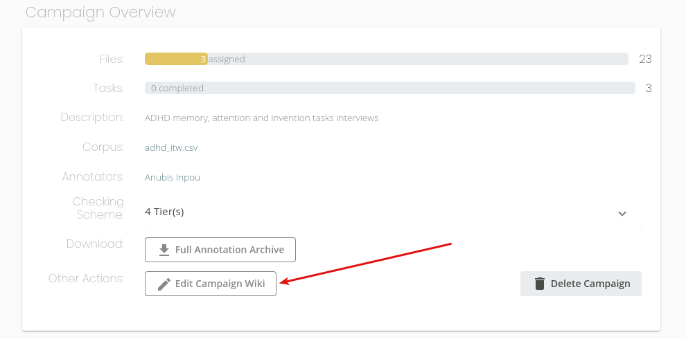

==========================
Campaign Creation Tutorial
==========================

This guide will teach you how to use Seshat as a Campaign Manager (the person in charge of assigning annotation
tasks and setting the annotation rules).

Before being able to follow this guide, make sure you have a working install of Seshat, and that you have
access to a manager's account.

Creating the Campaign
---------------------

First, let's give a bit of context for our example. Let's say that we have a corpus
of audio files that are recordings of ADHD subjects that were orally given a series of three oral tasks
designed find out more about their cognitive processes.

We want our annotators to :

* clearly delimit where each task begins and ends, knowing that each of these are in a contiguous sequence.
  These tasks are named `MEMORY`, `ATTENTION`, `INVENTION`.
* annotate the transcript of the subjects' speech.
* less importantly, indicate when the interviewer is talking (`INT`),
  or if there's another person talking (`OTH`),
* indicate if there's some distinguishable noise at that
  might decrease the recording's quality (`NOI`).

It's now quite clear that we want annotators to produce a 3-tiered annotation for each audio file, with a 4th
optional tier in case the interview is noisy. Let's get down to work and create our annotation campaign.

First, reach the **Campaigns** page, and click **Add Campaign**.

.. figure::  ../images/add_campaign.png
   :align:   center

Then, give your campaign a name, a description, select the right corpus, and enable the
the textgrid-checking option.

Then, let's specify a first tier. This one will contain annotations indicating
the current oral task for the subject. These task are contiguous, so no "empty annotations"
are allowed in this tier. To ensure that this condition is respected by annotators, deactivate the **Allow Empty**
slider. Also, set its **Validation options** to categorical (with categories `MEMORY`, `ATTENTION`, `INVENTION`).

Second, use the "+" button to add another tier. This one, called `SUBJECT`, will be for the subject's speech .
Annotations for this tier cannot be checked (it's arbitrary text), thus, leave "Validation Options" to
"None".

At last, add the two last tiers. The first one, called `NON-SUBJECT`, will be for `INT` and `OTH` annotations.
The other one, called `NOISE`,  is for optional `NOI` annotations, and is not always required. Annotators will thus be
able to delete this tier if they consider it to be useless.
Thus, deactivate the **Required** slider.

Finally, click **Create Campaign** to finish the campaign's creation. You should be redirected to your campaign's page.

Creating Annotators Accounts
----------------------------

Before being able to add annotation tasks, we first need to create annotators account for our
valiant scribes. In our case, we only have two of them: **Anubis** and **Seth**.
Reach the **Annotators** page, then click **Add annotators** to create annotators accounts.

    Creating an account for Anubis

    All annotators accounts are created.

Assigning Tasks
---------------

Now, let's go back to our campaign. Scroll down a bit, and click the **Assign task** button to create new
annotations tasks for your two annotators.

Then, assign 3 annotation tasks to anubis, each naturally corresponding to a different audio file.
Select the **Single Annotator** option and fill-in anubis's login. The **Deadline** option can be set
as an indicator to help the annotator know what tasks are more urgent, but has no real effect.

    Selecting the files assigned to Anubis

    Selecting the files assigned to Anubis

Then, click **Assign Tasks**. This will create 3 tasks for Anubis. Repeat this process
for Seth. this will create a number of tasks that can be viewed in the campaign's page.

Helping your annotators with the Wiki
-------------------------------------

If you want to give your annotators some extra help on how to annotate the
audio file, use the **Edit Campaign Wiki** option. Anything written in the wiki
will be displayed in the task's help, on the annotator's own interface.

Tracking the Campaign's Progress
--------------------------------

# TODO

Retrieving Annotated Files
--------------------------

At any time during the annotation process, you can download all the annotation
files as a nifty ZIP archive by clicking **Full Annotation Archive** on the campaign's page

